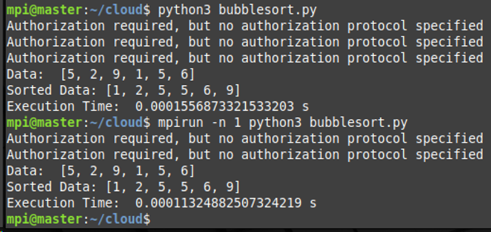
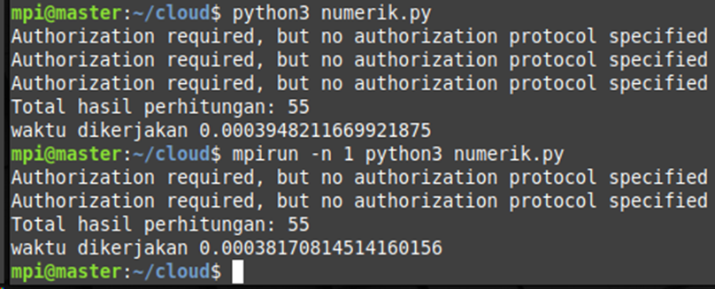

# Sefiyah - 09011182126014

## MPI

### Bubble Sort
    from mpi4py import MPI
    
    def bubble_sort_parallel(data):
        comm = MPI.COMM_WORLD
        rank = comm.Get_rank()
        size = comm.Get_size()
        
        local_data = data[rank::size]
        local_data.sort()
        
        for step in range(1, size):
            if rank % 2 == 0:
                if rank < size - 1:
                    comm.send(local_data, dest=rank+1)
                    received_data = comm.recv(source=rank+1)
                    local_data = merge(local_data, received_data)
            else:
                comm.send(local_data, dest=rank-1)
                received_data = comm.recv(source=rank-1)
                local_data = merge(local_data, received_data)
        
        sorted_data = comm.gather(local_data, root=0)
        if rank == 0:
            sorted_data = merge_sorted_arrays(sorted_data)
            return sorted_data
        else:
            return None
    
    def merge(arr1, arr2):
        merged_array = []
        i = j = 0
        while i < len(arr1) and j < len(arr2):
            if arr1[i] < arr2[j]:
                merged_array.append(arr1[i])
                i += 1
            else:
                merged_array.append(arr2[j])
                j += 1
        merged_array.extend(arr1[i:])
        merged_array.extend(arr2[j:])
        return merged_array
    
    def merge_sorted_arrays(arrays):
        merged_array = []
        for array in arrays:
            merged_array = merge(merged_array, array)
        return merged_array
    
    if _name_ == "_main_":
        data = [5, 2, 9, 1, 5, 6]
        comm = MPI.COMM_WORLD
        rank = comm.Get_rank()
        
        if rank == 0:
            sorted_data = bubble_sort_parallel(data)
            print("Sorted Data:", sorted_data)
        else:
            bubble_sort_parallel(data)

### Numerik
        from mpi4py import MPI
        import time
        
        start = time.time()
        
        def main():
            comm = MPI.COMM_WORLD
            rank = comm.Get_rank()
            size = comm.Get_size()
        
            # Data yang akan dihitung
            data = [1, 2, 3, 4, 5, 6, 7, 8, 9, 10]
        
            # Bagi data di antara proses
            chunk_size = len(data) // size
            start = rank * chunk_size
            end = (rank + 1) * chunk_size
        
            if rank == size - 1:
                # Pastikan semua data terhitung jika panjang data tidak habis dibagi oleh jumlah proses
                end = len(data)
        
            local_sum = sum(data[start:end])
        
            # Kumpulkan hasil dari semua proses
            total_sum = comm.reduce(local_sum, op=MPI.SUM, root=0)
        
            if rank == 0:
                print("Total hasil perhitungan:", total_sum)
        
        if _name_ == '_main_':
            main()
        end = time.time()
        print("waktu dikerjakan", end-start)

